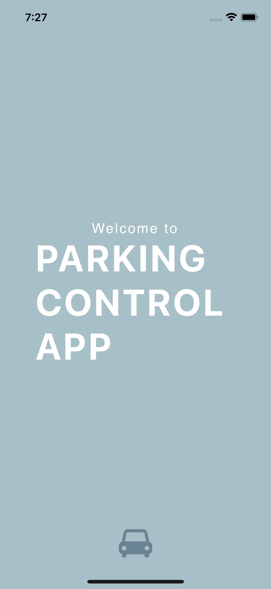
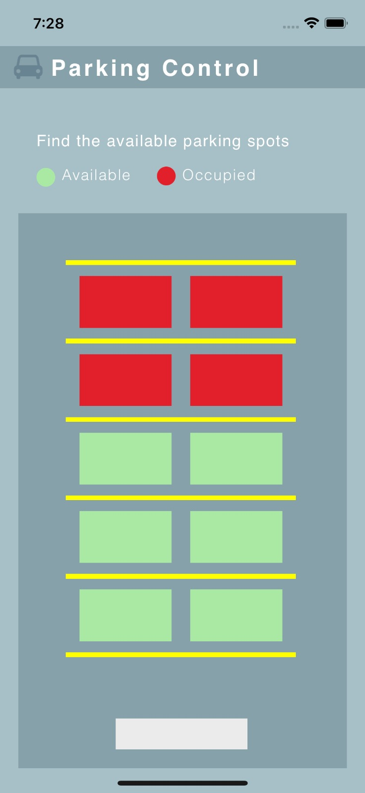

# parkingControl

Parking Control app is an iOS app that lets the user monitor a parking lot status in realtime. The objective of the application is to provide a visual representation of the available and unavailable parking spots during rush hours.

The application bases it functionaluty in IoT technology that connects to a hardware system, an ultrasonic sensor system, enabling real-time object proximity detection. It seamlessly transmits this data to a Firebase real-time database, which is then accessed by the app to provide users with a user-friendly interface for monitoring sensor information.

### Acknowledgments

This application could not have been made possible without the help of my amazing team: 
- Paola Ramos and Gabriela Medina, who worked on the hardware system and provided their knowledge to complete the parking lot simulation and worked to make the connection between the sensors and the database.
- Monica Escobedo who supported us throughout the development of the project and insights in design made possible this first mockup.

Truly greatfull with them :D
